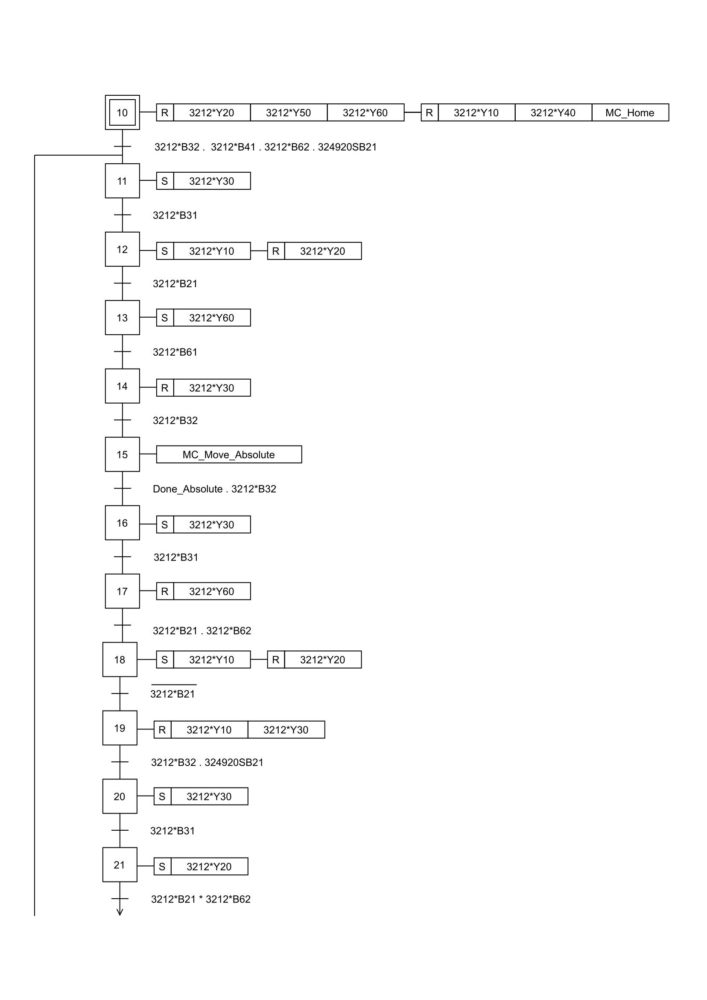
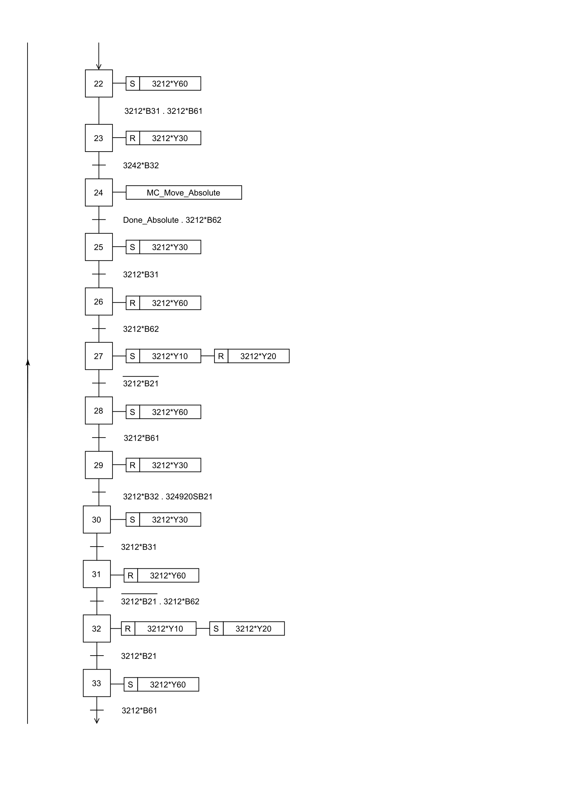
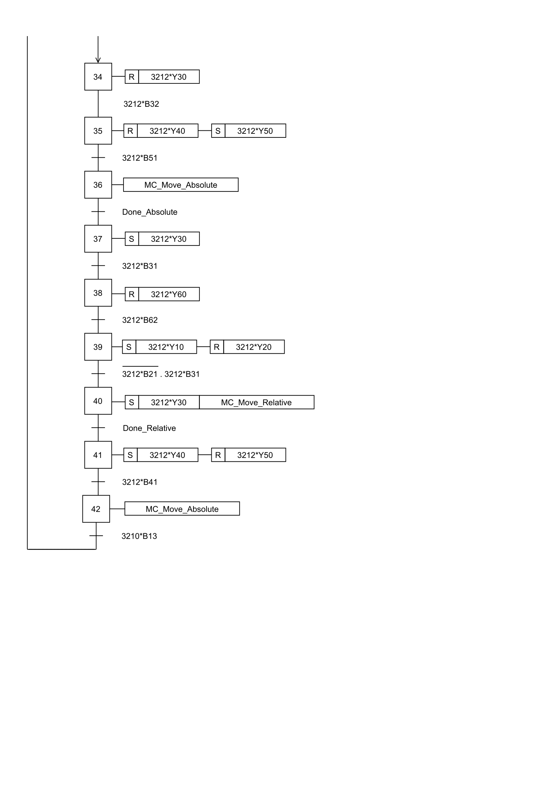
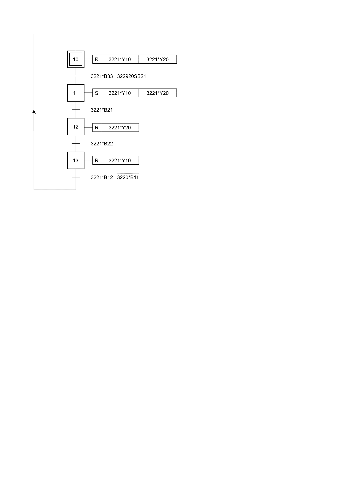
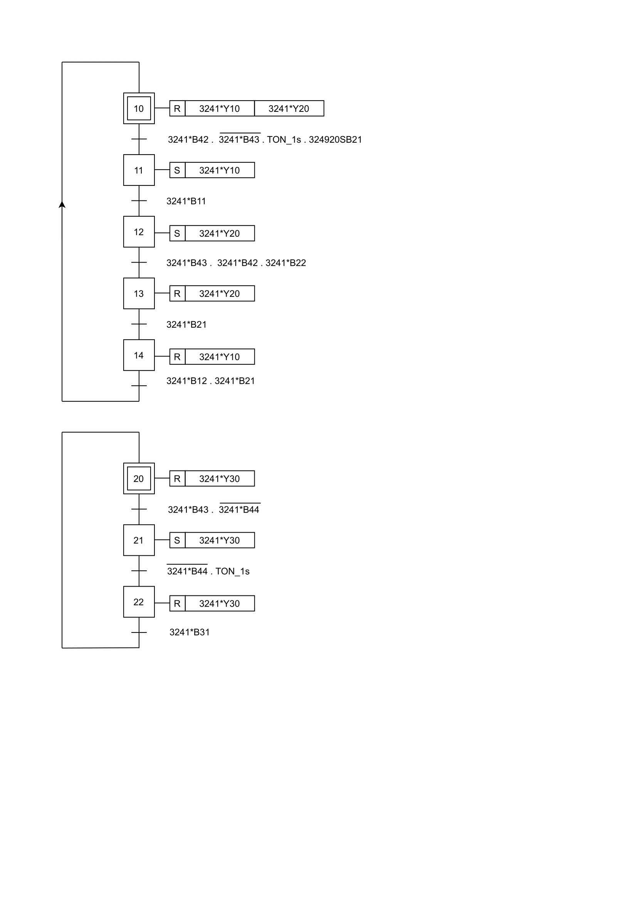
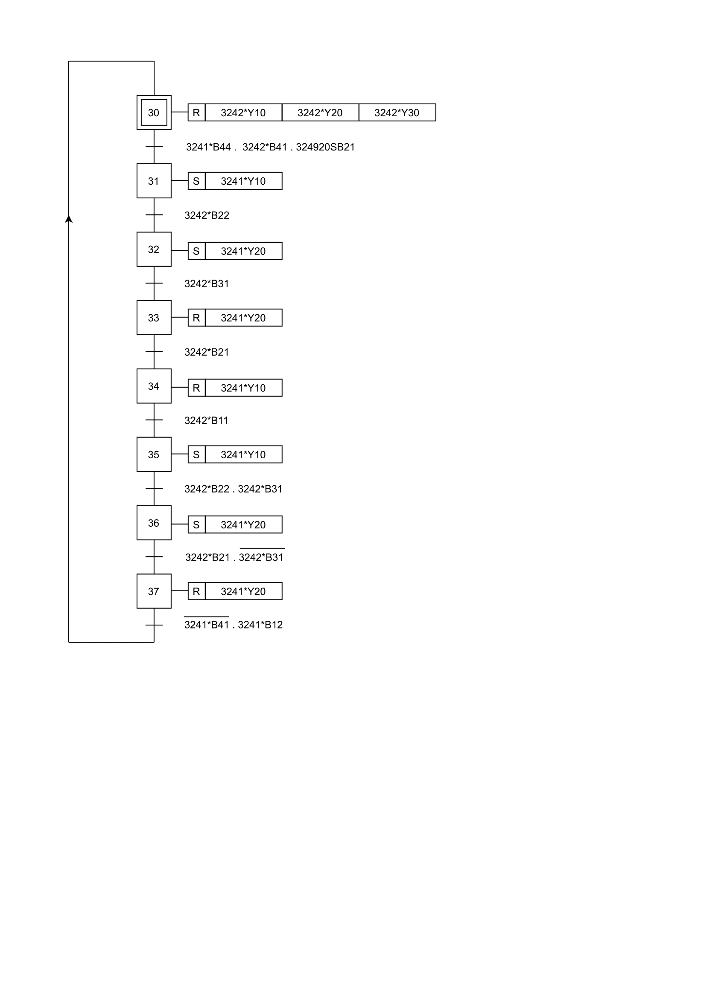
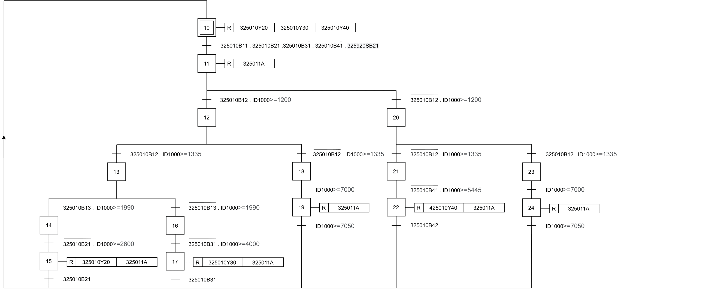

    

# Lu ban Workshop Portugal

## Grafcets da Linha 32 (YL-335B)

  <strong>Nome do Aluno:</strong> Luis Barroso // <strong>Número do Aluno:</strong> 190203015

**Grafcet da Estação 10**

**Grafcet da Estação 20**

**Grafcet da Estação 30**

**Grafcet da Estação 40**

**Grafcet da Estação 50**

